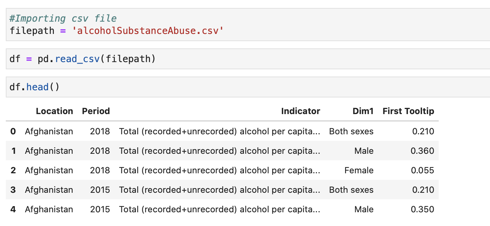
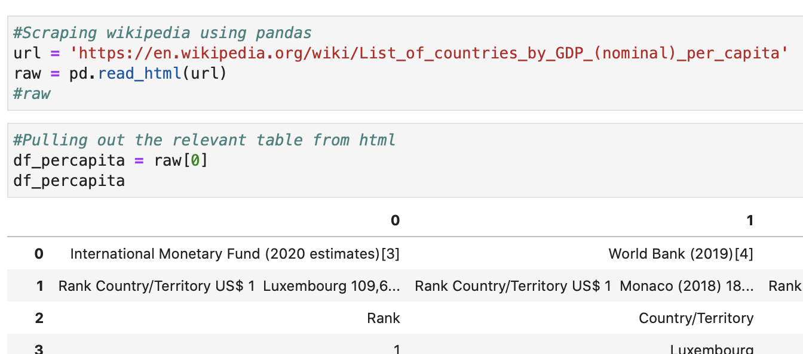
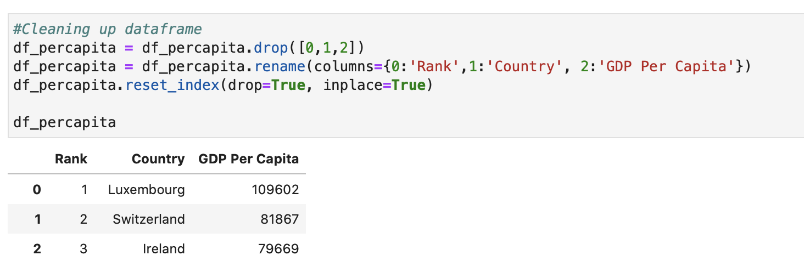
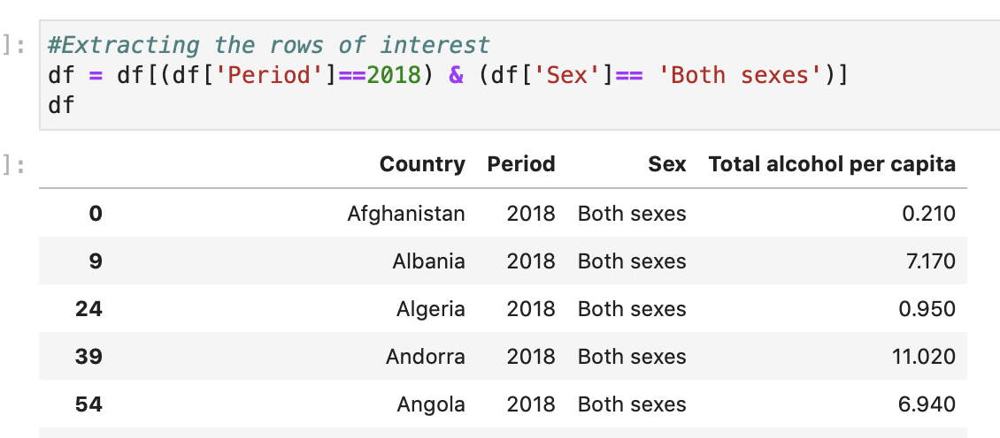
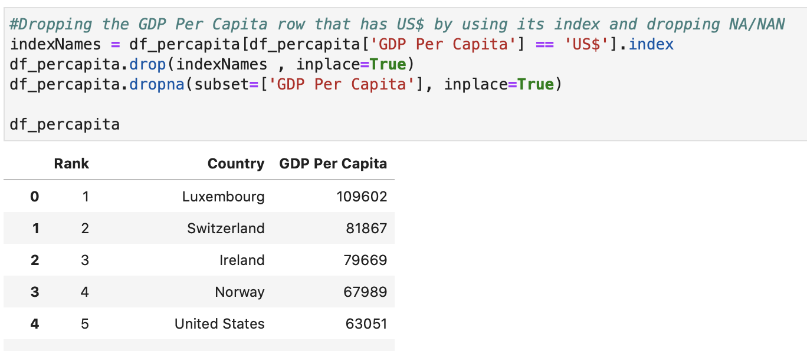
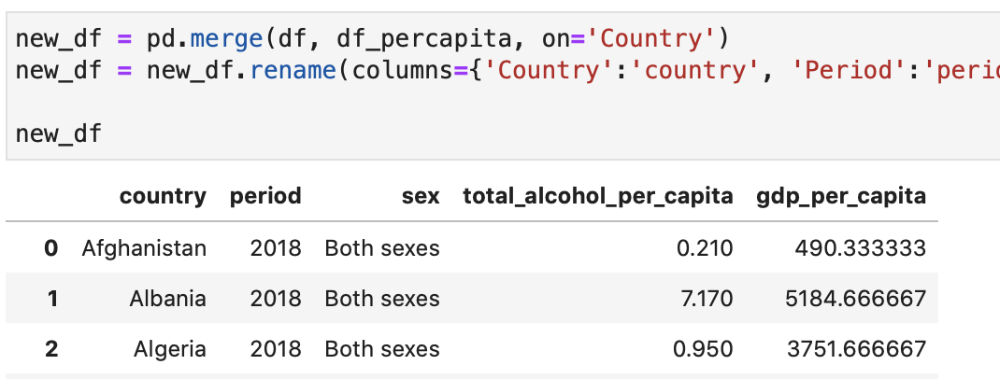
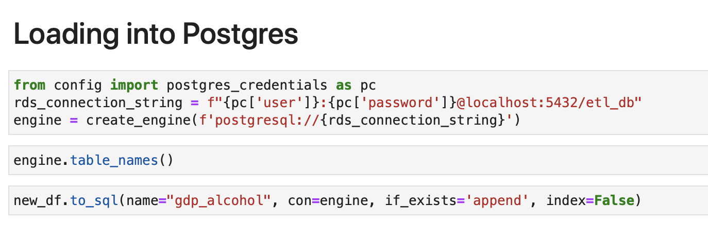

# ======== ETL PROJECT SUMMARY  ======== #

Overall, we have finished the project within the 3 hour timeframe we budgeted.  

### DATA SETS: 

* Alcohol Substance Abuse csv: https://www.kaggle.com/utkarshxy/who-worldhealth-statistics-2020-complete?select=alcoholSubstanceAbuse.csv
* GDP per capita: https://en.wikipedia.org/wiki/List_of_countries_by_GDP_(nominal)_per_capita

### EXTRACT: (Arthur, 10 minutes)

* We downloaded the total alcohol consumption per capita csv file from Kaggle.

* Then we scrapped GDP per capita dataset from wikipedia using pandas (pd.read_html).

### TRANSFORM: (Sonny & Dainty, 45 minutes)

* We renamed all columns with more descriptive titles and dropped the columns that were not relevant. 

* Transforming the data took the most of the time, much longer than we thought.  We had problems extracting the first instance of GDP per capita for every country (each country had 6 records of GDP per capita), we finally succeeded using .loc method. 

* We then tried to group the country and average all the GDP per capita for each country, but we found that there were string values in the column.  We spent quite bit of time trying to drop the two values that were not numbers.

* Afterwards, we merged both dataset on the 'country' column. 

### LOAD: (Mabel, 20 minutes)

* We created a table in Postgres to hold the dataframe we were loading from pandas
* The data types of the data in pandas were different from what we set in Postgres. This created a problem, and we were initally unable to load the data into Postgres.
* We proceeded to change the data types in pandas, so we could successfly load the data into Postgres.

